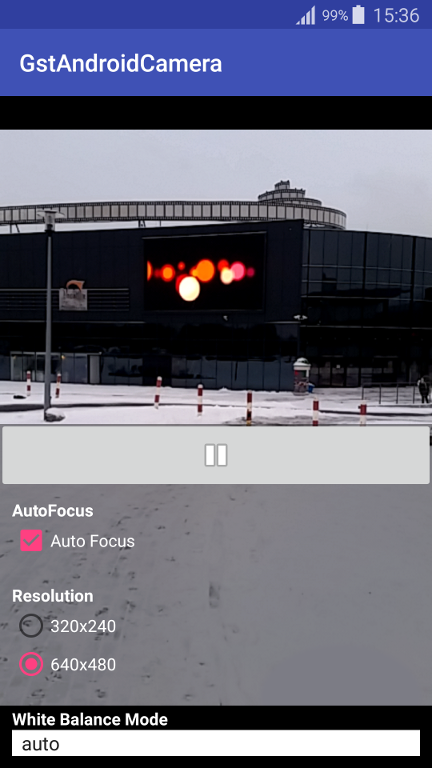

Example Android App for AHCSRC
==============================

Prerequisite
------------

 - Gstreamer SDK for Android (>=1.7.1)
 - Android Studio (=3.3)
 - Android NDK (>=r15b)
 - Gradle (=4.10.1)

Build and Installation
----------------------

 - Set GSTREAMER_ROOT_ANDROID evironment varible

```
  $ export GSTREAMER_ROOT_ANDROID=~/Library/Android/gstreamer-1.0-android-universal-1.14.4
```

- You may also want to set it in `gradle.properties`:

```
gstAndroidRoot=~/Library/Android/gstreamer-1.0-android-universal-1.14.4
``` 
 
- Create `local.properties` and add `sdk.dir` and `ndk.dir` properties:

```
  sdk.dir=/Users/justin/Library/Android/android-sdk-linux
  ndk.dir=/Users/justin/Library/Android/android-sdk-linux/android-ndk-r15c

```

 - Build with gradle

```
  $ gradle build
```

 - Install with gradle

```
  $ gradle installDebug
```

Screenshots
----------


Restrictions and Known bugs
---------------------------

 - ahcsrc element is a child element of GstPushSrc so it cannot be compatible
   with camerabin2 as it is.

 - No properties to set camera options like resolution, video formats.
   Each option can be set by caps filter.
   The options of real camera may vary on different android devices, so
   supported options should be analyzed on android application side.

```
import android.hardware.Camera;

camera = Camera.open();
Camera.Parameters parameters;
parameters = camera.getParameters();
  List<Size> supportedsizes = parameters.getSupportedPreviewSizes();
//List<Size> supportedsizes = parameters.getSupportedVideoSizes();
//List<Size> supportedsizes = parameters.getSupportedPictureSizes();
  for (Size size : supportedsizes) {
    Log.d("supported sizes", "Size: " + size.width + "x" + size.height);
  }
camera.release();
```
